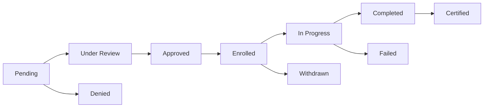

# 📋 PESO Training Management - Comprehensive Testing Guide

This guide provides step-by-step instructions for testing the advanced PESO training management features, including attendance tracking, completion awards, and certification workflows.

---

## 📑 Table of Contents

1. [System Overview](#system-overview)
2. [Test Account Details](#test-account-details)
3. [Prerequisites](#prerequisites)
4. [Database Schema Updates](#database-schema-updates)
5. [Testing Workflow](#testing-workflow)
   - [Phase 1: Application Review](#phase-1-application-review)
   - [Phase 2: Enrollment](#phase-2-enrollment)
   - [Phase 3: Attendance Tracking](#phase-3-attendance-tracking)
   - [Phase 4: Training Progress](#phase-4-training-progress)
   - [Phase 5: Completion Awards](#phase-5-completion-awards)
   - [Phase 6: Certificate Generation](#phase-6-certificate-generation)
6. [Status Progression Reference](#status-progression-reference)
7. [Troubleshooting](#troubleshooting)

---

## 🎯 System Overview

The PESO training management system has been enhanced with the following features:

### **New Features**
✅ **Attendance Tracking**: Mark attendance for enrolled/in-progress trainees
✅ **Completion Status**: Award passed/failed/pending status with training hours
✅ **Enhanced Notifications**: Descriptive notifications for each milestone
✅ **Training Hours**: Track hours awarded (0-720 hours max)
✅ **Completion Notes**: Add custom notes for each trainee
✅ **Statistics Dashboard**: Real-time training progress metrics
✅ **Status Badges**: Color-coded badges matching job application pattern

### **Database Enhancements**
- `completion_status` ENUM: passed, failed, pending
- `training_hours_awarded` DECIMAL(5,2): 0 to 720 hours
- `attendance_marked_at` TIMESTAMPTZ: Attendance timestamp
- `completion_notes` TEXT: Optional notes for completion
- `training_program_status` ENUM: Added 'scheduled' and 'ongoing'

---

## 👤 Test Account Details

### **PESO Admin Account**
- **Email**: peso@test.com
- **Password**: Test123!
- **Role**: PESO
- **Purpose**: Test PESO officer workflows

### **Applicant Test Account**
- **Email**: janmikoguevarra@gmail.com
- **Password**: Test123!
- **Role**: APPLICANT
- **Purpose**: Test applicant experience and notifications

---

## ✅ Prerequisites

### **1. Environment Setup**
```bash
# Ensure development server is running
npm run dev
```

### **2. Database Migration**
The migration `add_advanced_peso_training_fields` should already be applied. Verify with:
```bash
# Check Supabase dashboard > Database > Migrations
# Should see: add_advanced_peso_training_fields (applied)
```

### **3. Cleanup Test Data** (Start Fresh)
```bash
# Remove existing training applications for test account
node scripts/cleanup-test-training-data.mjs
```

Expected output:
```
🧹 Starting cleanup of test training data...
✅ Found test user: Jan Miko Guevarra (uuid)
📊 Found X training application(s)
✅ Successfully deleted X training application(s)
✨ Cleanup Complete!
```

### **4. Create Test Training Program** (If None Exists)
1. Login as PESO admin (peso@test.com)
2. Navigate to: **PESO → Programs**
3. Click **Create Training Program**
4. Fill in:
   - Title: "Advanced Web Development Training"
   - Description: "Comprehensive full-stack development course"
   - Duration: "40 hours"
   - Start Date: (Select future date)
   - Requirements: "Basic programming knowledge"
   - Slots: 10
   - Status: Active
5. Click **Create**

---

## 📊 Database Schema Updates

### **training_applications Table**
| Column | Type | Description |
|--------|------|-------------|
| `completion_status` | ENUM | passed, failed, pending, or NULL |
| `training_hours_awarded` | DECIMAL(5,2) | Hours awarded (0-720) |
| `attendance_marked_at` | TIMESTAMPTZ | When attendance was first marked |
| `completion_notes` | TEXT | Custom notes for completion |

### **training_programs Table**
| Column | Type | Values |
|--------|------|--------|
| `status` | ENUM | draft, active, scheduled, ongoing, completed, archived |

---

## 🧪 Testing Workflow

### **Phase 1: Application Review**

#### **Step 1.1: Create Application (Applicant Side)**
1. **Logout** from PESO account
2. **Login** as applicant: `janmikoguevarra@gmail.com`
3. Navigate to: **Applicant → Browse Trainings**
4. Find "Advanced Web Development Training"
5. Click **Apply Now**
6. Fill out application form:
   - Full Name: Jan Miko Guevarra
   - Email: janmikoguevarra@gmail.com
   - Phone: 09123456789
   - Address: 123 Test St, Manila
   - Highest Education: Bachelor's Degree
   - Upload Valid ID (any image file)
7. Click **Submit Application**

**✅ Expected Results:**
- Success toast: "Application submitted successfully"
- Application appears in **My Applications** page
- Status badge: 🟡 **Pending Review**
- Notification: "Your application for Advanced Web Development Training has been received"

---

#### **Step 1.2: Review Application (PESO Side)**
1. **Logout** from applicant account
2. **Login** as PESO: `peso@test.com`
3. Navigate to: **PESO → Training Applications**

**✅ Expected Results:**
- Dashboard shows updated statistics:
  - **Total Applications**: 1
  - **Pending Review**: 1
- Application appears in table with:
  - Full Name: Jan Miko Guevarra
  - Status: 🟡 **Pending Review**
  - Training: Advanced Web Development Training

---

#### **Step 1.3: Mark as Under Review**
1. Click **Actions** (⋮) for Jan Miko's application
2. Select **Mark as Under Review**
3. Confirm action

**✅ Expected Results:**
- Status changes to: 🔵 **Under Review**
- Applicant receives notification: "Your application is now under review"
- Statistics update: Pending Review decreases to 0

---

#### **Step 1.4: Approve Application**
1. Click **Actions** (⋮) for Jan Miko's application
2. Select **Approve**
3. Add optional next steps message:
   ```
   Congratulations! Please wait for enrollment confirmation with the training schedule.
   ```
4. Click **Approve Application**

**✅ Expected Results:**
- Status changes to: 🟢 **Approved**
- Success toast: "Application approved successfully"
- Applicant receives notification with next steps
- Statistics: **Approved** count increases to 1

---

### **Phase 2: Enrollment**

#### **Step 2.1: Enroll Applicant**
1. Click **Actions** (⋮) for Jan Miko's application
2. Select **Enroll**
3. Confirm enrollment

**✅ Expected Results:**
- Status changes to: 🔵 **Enrolled**
- Success toast: "Applicant enrolled successfully"
- Applicant receives notification: "You have been enrolled in Advanced Web Development Training"
- Statistics: **Enrolled** count increases to 1
- **New Action Available**: "Mark Attendance" button appears

---

### **Phase 3: Start Training & Mark Attendance** ⭐ NEW

> **📋 Note**: Marking attendance **officially starts training** for enrolled trainees. There is no separate "Start Training" action.

#### **Step 3.1: Open Mark Attendance Modal**
1. Click **Actions** (⋮) for Jan Miko's application
2. Select **Mark Attendance** (this will also start training)

**✅ Expected Results:**
- Modal opens: "Start Training & Mark Attendance"
- Shows program info: Advanced Web Development Training
- Description clarifies: "This will officially start training for selected applicants"
- Lists all enrolled/in-progress applicants
- Checkbox-style selection interface
- Summary shows: "0 Present, 1 No Show"

---

#### **Step 3.2: Mark Attendance & Start Training**
1. Check the box for **Jan Miko Guevarra**
2. Verify visual indicators:
   - Card background: Green (✅ Present)
   - Checkbox: Checked
   - Visual icon: UserCheck (green)
3. Summary should update to: "1 Present, 0 No Show"
4. Click **Mark 1 as Present**

**✅ Expected Results:**
- Success toast: "Successfully marked attendance for 1 applicant(s)"
- Modal closes
- Application status changes to: 🔵 **In Progress** (training officially started)
- `attendance_marked_at` timestamp is set
- `training_started_at` timestamp is set (same timestamp)
- Training program status auto-transitions to: **Ongoing**
- Applicant receives notification: "Your attendance for Advanced Web Development Training has been recorded"
- Statistics: **In Progress** count increases to 1

---

#### **Step 3.3: Verify Attendance Persistence**
1. Click **Actions** (⋮) again
2. Select **Mark Attendance**

**✅ Expected Results:**
- Modal opens with Jan Miko **pre-selected** (checkbox already checked)
- Shows badge: "Previously Marked" (blue)
- Can modify attendance if needed

---

### **Phase 4: Training Progress**

#### **Step 4.1: Verify In-Progress Status**
1. Check PESO Dashboard
2. Verify statistics show:
   - In Progress: 1
   - Enrolled: 0 (moved to in-progress)

**✅ Expected Results:**
- Dashboard reflects accurate training progress
- Recent applications show current status
- Training program shows "Ongoing" status

---

### **Phase 5: Completion Awards** ⭐ NEW

#### **Step 5.1: Open Award Completion Modal**
1. Navigate to **PESO → Training Applications**
2. Click **Actions** (⋮) for Jan Miko's application
3. Select **Award Completion**

**✅ Expected Results:**
- Modal opens: "Award Training Completion"
- Shows program info with duration (40 hours)
- **Bulk Settings** section displays:
  - Completion Status dropdown: Passed (default)
  - Hours Awarded input: 40 (auto-filled from program duration)
  - Notes textarea
- Lists applicants with attendance marked
- Expandable card interface
- Summary: "1 Passed, 0 Failed, 0 Pending"

---

#### **Step 5.2: Award Completion - Passed**
1. Jan Miko should already be selected (checkbox)
2. Click on card to expand individual settings
3. Verify default values:
   - Completion Status: **Passed**
   - Hours Awarded: **40**
4. Add completion notes (optional):
   ```
   Excellent performance throughout the training. Demonstrated strong understanding of full-stack concepts.
   ```
5. Click **Award Completion (1)**

**✅ Expected Results:**
- Success toast: "Successfully awarded completion for 1 applicant(s)"
- Status changes to: ⚪ **Completed**
- `completion_status`: passed
- `training_hours_awarded`: 40
- `completion_notes`: [your notes]
- `training_completed_at`: [current timestamp]
- Applicant receives notification: "Congratulations! You have successfully completed Advanced Web Development Training and earned 40 hours"
- Statistics: **Completed** count increases to 1, **In Progress** decreases to 0
- **New Action Available**: "Issue Certificate" button appears

---

#### **Step 5.3: Test Bulk Settings (Optional)**
To test bulk settings with multiple applicants:
1. Create 2-3 more applications and enroll them
2. Mark their attendance
3. Open **Award Completion**
4. Use **Bulk Settings**:
   - Set Status: Passed
   - Set Hours: 35
   - Add Note: "Good performance overall"
5. Click **Apply to Selected (3)**
6. Verify all selected applicants get the bulk values
7. Customize individual applicants if needed
8. Award completion

---

#### **Step 5.4: Test Failed Status (Optional)**
1. Create another test application
2. Enroll and mark attendance
3. Award completion with:
   - Status: **Failed**
   - Hours: 0
   - Notes: "Did not meet minimum attendance requirements"

**✅ Expected Results:**
- Warning message displays: "⚠️ 1 applicant will be marked as Failed"
- Status changes to: 🔴 **Failed**
- Notification: "Your training completion for... has been marked as failed. Reason: [notes]"
- No certificate option available

---

### **Phase 6: Certificate Generation**

#### **Step 6.1: Issue Certificate**
1. Navigate to completed application (Status: ⚪ Completed, Completion Status: Passed)
2. Click **Actions** (⋮)
3. Select **Issue Certificate**

**✅ Expected Results:**
- Modal opens: "Generate Training Certificate"
- Shows certificate preview with:
  - Trainee: Jan Miko Guevarra
  - Program: Advanced Web Development Training
  - Duration: 40 hours
  - Completion: [current date]
- Digital signature checkbox (if signature uploaded)

---

#### **Step 6.2: Preview Certificate**
1. Click **Preview PDF**

**✅ Expected Results:**
- PDF opens in new tab
- Certificate shows all correct information
- Professional formatting
- Digital signature (if selected and available)

---

#### **Step 6.3: Generate and Issue**
1. Close preview
2. Check "Include my digital signature" (if available)
3. Click **Generate & Issue**

**✅ Expected Results:**
- Success toast: "Certificate generated and issued successfully!"
- Status changes to: 🟡 **Certified**
- Certificate stored in database
- Applicant receives notification: "Your training certificate for Advanced Web Development Training is now available"
- Statistics: **Certified** count increases to 1, **Completed** decreases to 0
- Training program can transition to **Completed** if all applicants are processed

---

## 📈 Status Progression Reference

### **Complete Training Lifecycle**



### **Status Descriptions**

| Status | Badge Color | Trigger | Description |
|--------|------------|---------|-------------|
| **Pending** | 🟡 Yellow | Application submitted | Awaiting PESO review |
| **Under Review** | 🔵 Blue | PESO action | Being evaluated |
| **Approved** | 🟢 Green | PESO approval | Eligible for enrollment |
| **Denied** | 🔴 Red | PESO denial | Application rejected |
| **Enrolled** | 🔵 Purple | PESO enrollment | Officially enrolled |
| **In Progress** | 🔵 Teal | Attendance marked | Training started |
| **Completed** | ⚪ Gray | Completion awarded (passed) | Training finished |
| **Failed** | 🔴 Red | Completion awarded (failed) | Did not complete |
| **Certified** | 🟡 Yellow | Certificate issued | Certificate awarded |
| **Withdrawn** | ⚪ Gray | Applicant withdrawal | Applicant dropped out |

---

## 🛠️ Troubleshooting

### **Issue: Attendance modal shows no applicants**
**Solution**: Ensure applicants have:
- Status: enrolled, in_progress, or approved
- Check API endpoint: `/api/training/applications?program_id={id}&status=approved,enrolled,in_progress`

---

### **Issue: Completion modal shows no applicants**
**Solution**: Ensure applicants have:
- Status: in_progress or completed
- `attendance_marked_at` is not null
- Check filter in code: `applicationsWithAttendance.filter(app => app.attendance_marked_at !== null)`

---

### **Issue: Hours awarded validation error**
**Solution**:
- Hours must be between 0 and 720
- Format: DECIMAL(5,2) - allows up to 999.99
- Example valid values: 40, 40.5, 120.25

---

### **Issue: Statistics not updating**
**Solution**:
1. Click **Refresh** button
2. Check browser console for errors
3. Verify Supabase connection
4. Check RLS policies for training_applications table

---

### **Issue: Notifications not appearing**
**Solution**:
1. Check applicant notifications page
2. Verify `notifications` table has entries
3. Check API responses in Network tab
4. Ensure notification preferences are enabled

---

### **Issue: Certificate generation fails**
**Solution**:
1. Ensure application status is 'completed'
2. Verify `completion_status` is 'passed'
3. Check API endpoint: `/api/training/certificates/generate`
4. Review server logs for errors

---

### **Issue: Training program status not auto-updating**
**Solution**:
- Scheduled → Ongoing: Triggered when first attendance is marked
- Ongoing → Completed: Triggered when all enrolled applicants are completed/failed/certified
- Check logic in attendance and completion API endpoints

---

## ✅ Final Checklist

After completing all tests, verify:

- [ ] All status transitions work correctly
- [ ] Attendance tracking marks applicants accurately
- [ ] Completion awards set proper status and hours
- [ ] Notifications are sent for each milestone
- [ ] Statistics update in real-time
- [ ] Certificates generate successfully
- [ ] Status badges display correct colors
- [ ] Bulk operations work for multiple applicants
- [ ] Individual customization overrides bulk settings
- [ ] Failed applicants don't get certificate option
- [ ] Training program status auto-transitions correctly

---

## 📝 Notes

- **Test Data**: Always run cleanup script before comprehensive testing
- **Bulk Testing**: Create 5-10 test applications to test bulk operations
- **Edge Cases**: Test scenarios like:
  - Marking attendance for already attended applicants
  - Awarding completion without marking attendance (should fail)
  - Issuing certificate for failed applicants (should not be available)
  - Concurrent PESO officers marking attendance

---

## 🎉 Completion

Once all test cases pass, the PESO training management system is ready for production use!

For issues or questions, refer to:
- **Codebase**: Check component comments and API documentation
- **Database**: Review migration file for schema details
- **Supabase**: Check logs in Supabase dashboard

---

**Last Updated**: 2025-11-04
**Version**: 1.0.0
**Maintained By**: Development Team
